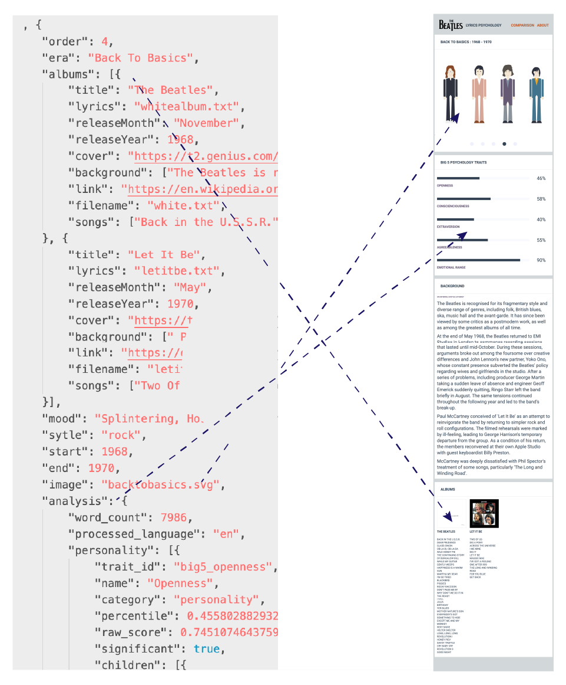

# Toolkit For Psychology of Artist's Song Writing

This repository provides tools built around [Genius Lyrics](https://genius.com/) and [Watson Personality Insights](https://www.ibm.com/watson/services/personality-insights/) to create a template for analyzing the changes of an artist's song writing over the duration of their careers.

You can see examples of the product of these tools here:

- [Mac Miller Lyrics Psychology](https://mcconville.github.io/macmiller)

 - [Beatles Lyrics Psychology](https://mcconville.github.io/beatles)

 The repo has two Node JS Scripts:

 - lyricsfinder.js
 - paperbackwriter.js

**lyricsfinder** will read a json data file containing album and song titles for an artist, and will build a text file of lyrics for each album.

**paperbackwriter** will use the same json data structure AND the generated lyrics files to run Watson Personality Insights on the lyrics, inserting the output of Watson PI to the datastructure.

In addition, the repo has a set of webcomponents that are capable of reading the complete json data file and presenting the data in a human readable way.


### Data Structure

The foundation for the lyrics project is a data structure describing the timeline of the artist involved. The first step is to figure out the eras of the artist. I've done this in one of two ways:

- each album represents an era of the artist
- an era of the artist consists of one or more albums

```

```

### Data Mapping

Here is how the JSON data maps to the responsive mobile view.



### Practical Web Components

[Web Components](https://developer.mozilla.org/en-US/docs/Web/Web_Components) are an open standard approach for modularizing and reusing user interface pieces on a page. 

In the past, web pages have been written with javascript, html and css code that divide related pieces in javascript, html or css files that are effecively long lists of DOM elements, style and function.

 Web Components aim to collect related javascript, style and DOM elements for a related element, and then allow the components to be placed, as custom DOM elements in a building block approach.

 In recent years, a range of JavaScript libraries have appeared that enable developers to make componentized pieces. Two notable technologies are [React](https://reactjs.org/) and [Vue](https://vuejs.org/). These are more accepted and established approaches for teams to build with 'web components'.

 For this lyrics project, I've chosen to work with the evolving world wide web open standard of Web Components, because I like that most browsers ship with the capability built in - I don't need to use an additional library, and for the most part, it is a minimal, yet powerful enough approach for me to achieve the solution I'm looking for.


